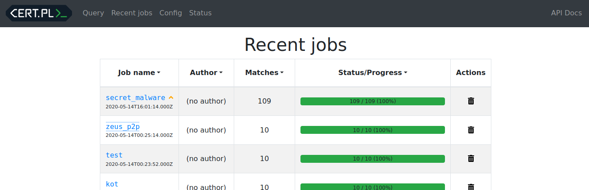
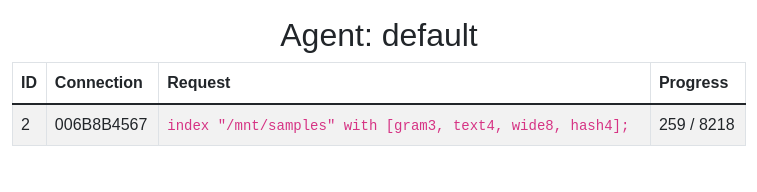
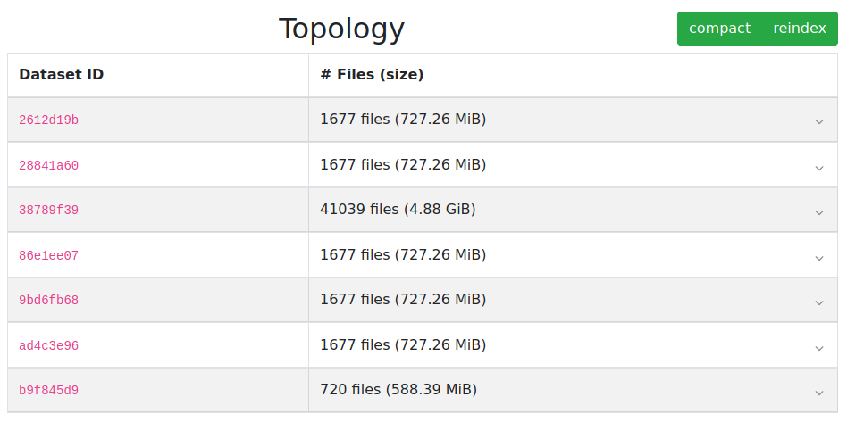
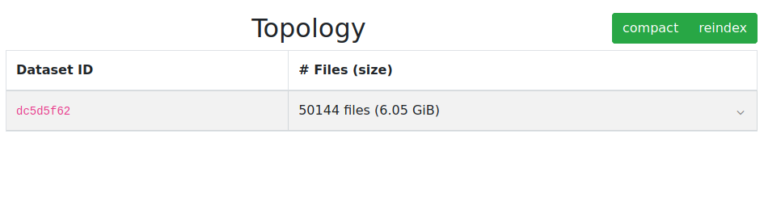

# mquery: Blazingly fast Yara queries for malware analysts

Ever had trouble searching for malware samples? Mquery is an
analyst-friendly web GUI to look through your digital warehouse.

It can be used to search through terabytes of malware in a blink of an eye:


_(a bit outdated) screencast_

Under the hood we use our [UrsaDB](https://github.com/CERT-Polska/ursadb), to
accelerate yara queries with ngrams.

## Demo

Public instance will be created soon, stay tuned...

## Quickstart

### 1. Install and start

The easiest way to do this is with `docker-compose`:

```
git clone --recurse-submodules https://github.com/CERT-Polska/mquery.git
cd mquery
vim .env  # optional - change samples and index directory locations
docker-compose up --scale daemon=3  # building the images will take a while
```

The web interface should be available at `http://localhost`.



*(For more installation options see the [installation manual](./INSTALL.md) ).*

### 2. Add the files

Put some files in the `SAMPLES_DIR` (by default `./samples` in the repository,
configurable with variable in the `.env` file).

### 3. Index your collection

If you use the default configuration, just click "reindex" button on the status
page:


This will scan samples directory for all new files and index them. You can
monitor the progress in the `tasks` window on the left:



You have to repeat this process every time you want to add new files!

After indexing is over, you will notice new datasets:



Merging datasets takes time, but having too many datasets slows mquery down.
Click `compact` button to merge some datasets with each other (or use the
[compactall](./docs/utils/compactall.md) script).

After this process, you end up with a nice, clean index:



This is a good and easy way to start, but if you have a big collection you are
strongly encouraged to read [indexing page](./docs/indexing.md) in the manual. 

### 4. Test it

Now your files should be searchable - insert any Yara rule into the search
window and click `Query`. Just for demonstration, I've indexed the source code
of this application and tested this Yara rule:

```
rule mquery_exceptions {
    strings: $a = "Exception"
    condition: all of them
}
```


## Learn more

See the [documentation](./docs/README.md) to learn more. Probably a good idea
if you plan a bigger deployment.

You can also read the hosted version here:
[cert-polska.github.io/mquery/docs](https://cert-polska.github.io/mquery/docs).

## Installation

See the
[installation instruction](./INSTALL.md).

## Contributing

If you want to contribute, see our dedicated
[documentation for contributors](./CONTRIBUTING.md).

## Contact

If you have any problems, bugs or feature requests related to mquery, you're
encouraged to create a GitHub issue.

If you have questions unsuitable for github, you can email CERT.PL
(info@cert.pl) directly.
