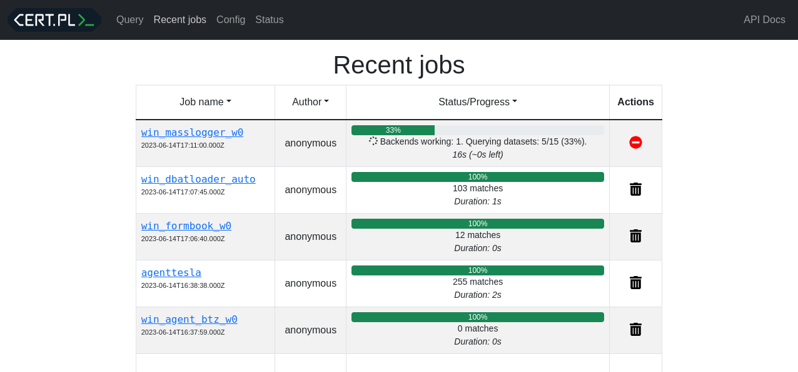
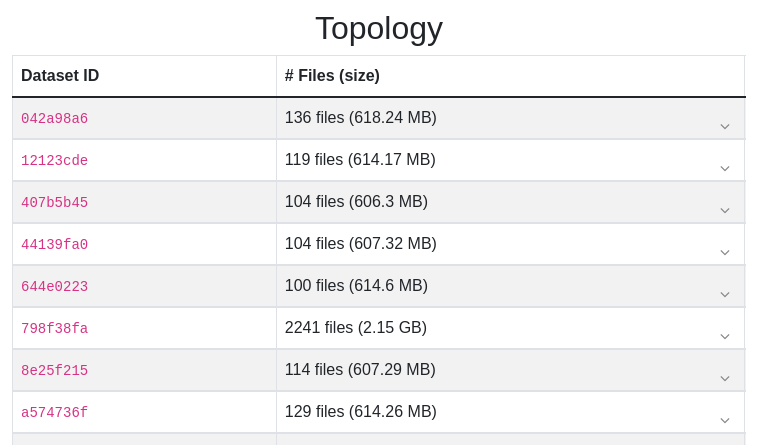
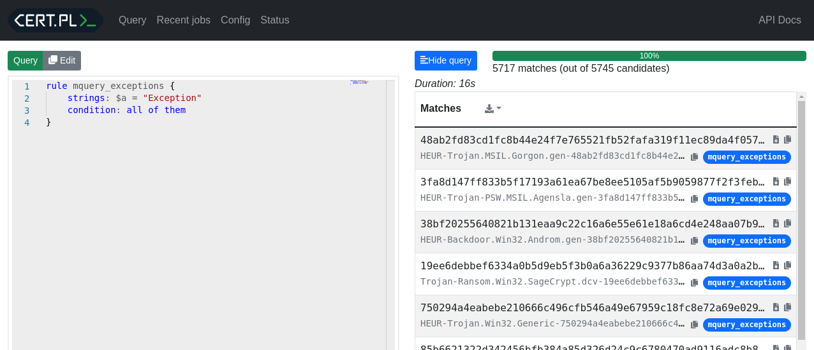

# mquery: Blazingly fast Yara queries for malware analysts

Ever had trouble searching for malware samples? Mquery is an
analyst-friendly web GUI to look through your digital warehouse.

It can be used to search through terabytes of malware in a blink of an eye:


Under the hood we use our [UrsaDB](https://github.com/CERT-Polska/ursadb), to
accelerate yara queries with ngrams.

## Demo

Public instance will be created soon, stay tuned...

## Quickstart

### 1. Install and start

The easiest way to do this is with `docker compose`:

```
git clone https://github.com/CERT-Polska/mquery.git
cd mquery
vim .env  # optional - change samples and index directory locations
docker compose up --scale daemon=3  # building the images will take a while
```

The web interface should be available at `http://localhost`.



*(For more installation options see the [installation manual](./INSTALL.md) ).*

### 2. Add the files

Put some files in the `SAMPLES_DIR` (by default `./samples` in the repository,
configurable with variable in the `.env` file).

### 3. Index your collection

Launch ursacli in docker:

```shell
docker compose exec ursadb ursacli
[2023-06-14 17:20:24.940] [info] Connecting to tcp://localhost:9281
[2023-06-14 17:20:24.942] [info] Connected to UrsaDB v1.5.1+98421d7 (connection id: 006B8B46B6)
ursadb>
```

Index the samples with n-grams of your choosing (this may take a while!)

```shell
ursadb> index "/mnt/samples" with [gram3, text4, wide8, hash4];
[2023-06-14 17:29:27.672] [info] Working... 1% (109 / 8218)
[2023-06-14 17:29:28.674] [info] Working... 1% (125 / 8218)
...
[2023-06-14 17:37:40.265] [info] Working... 99% (8217 / 8218)
[2023-06-14 17:37:41.266] [info] Working... 99% (8217 / 8218)
{
    "result": {
        "status": "ok"
    },
    "type": "ok"
}
```


This will scan samples directory for all new files and index them. You can
monitor the progress in the `tasks` window on the left:


You have to repeat this process every time you want to add new files!

After indexing is over, you will notice new datasets:



This is a good and easy way to start, but if you have a big collection you are
strongly encouraged to read [indexing page](./docs/indexing.md) in the manual. 

### 4. Test it

Now your files should be searchable - insert any Yara rule into the search
window and click `Query`. Just for demonstration, I've indexed the source code
of this application and tested this Yara rule:

```
rule mquery_exceptions {
    strings: $a = "Exception"
    condition: all of them
}
```



## Learn more

See the [documentation](./docs/README.md) to learn more. Probably a good idea
if you plan a bigger deployment.

You can also read the hosted version here:
[cert-polska.github.io/mquery/docs](https://cert-polska.github.io/mquery/docs).

## Installation

See the
[installation instruction](./INSTALL.md).

## Contributing

If you want to contribute, see our dedicated
[documentation for contributors](./CONTRIBUTING.md).

## Changelog

Learn how the project has changed by reading our
[release log](./RELEASES.md).

## Contact

If you have any problems, bugs or feature requests related to mquery, you're
encouraged to create a GitHub issue.

You can chat about this project on Discord:

[](https://discord.gg/3FcP6GQNzd)

If you have questions unsuitable for Github or discord, you can email CERT.PL
(info@cert.pl) directly.
