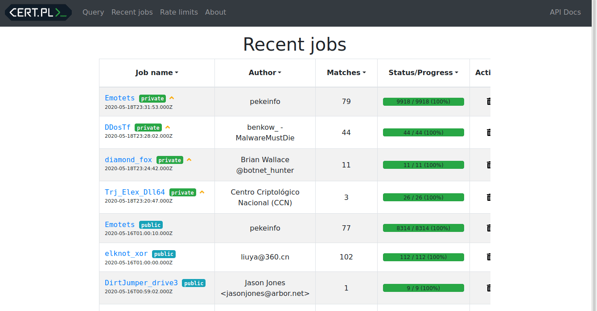
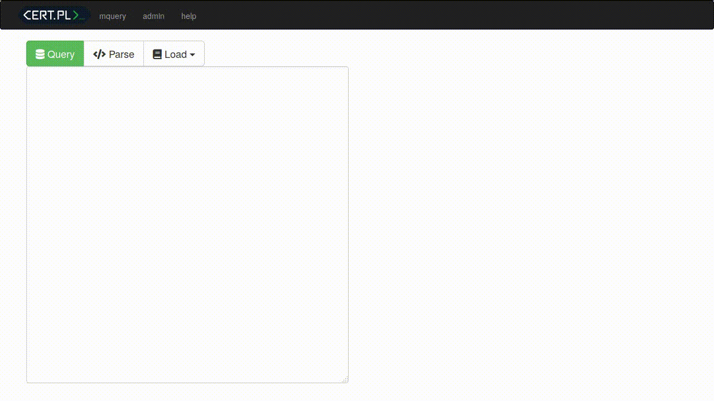

# Version 1.2

### New features

- Results streaming (first results appear faster) [(#59)](https://github.com/CERT-Polska/mquery/pull/59)
- Support for distributed Ursadb in the backend [(#119)](https://github.com/CERT-Polska/mquery/pull/119)
- Powerful plugin support (See the [./docs/plugins.md](documentation))
    - Configurable from the web UI [(#132)](https://github.com/CERT-Polska/mquery/pull/132)
- Support for Ursadb tags (for example, to tag collections as benign or malicious) [(#44)](https://github.com/CERT-Polska/mquery/pull/44)

### UI Improvements

- Use Monaco IDE as yara editor [(#109)](https://github.com/CERT-Polska/mquery/pull/#109)
- Results view improvements [issue #82](https://github.com/CERT-Polska/mquery/issues/82)
    - Remove old jobs [(#180)](https://github.com/CERT-Polska/mquery/pull/#180)
    - Show query ETA and duration [(#175)](https://github.com/CERT-Polska/mquery/pull/175)
    - Show sample sha256 [(#156)](https://github.com/CERT-Polska/mquery/pull/156) [(#167)](https://github.com/CERT-Polska/mquery/pull/167)
    - Download matched files or sha256 hashes [(#176)](https://github.com/CERT-Polska/mquery/pull/#176) [(#163)](https://github.com/CERT-Polska/mquery/pull/#163)
    - Add pagination to the results table [(#96)](https://github.com/CERT-Polska/mquery/pull/#96)
- Status page improvements:
    - Display file count along with dataset size [(#91)](https://github.com/CERT-Polska/mquery/pull/#91)
- Filter jobs by author, status and others [(#152)](https://github.com/CERT-Polska/mquery/pull/#152)
- Show number of errors (for example, missing files) per job [(#148)](https://github.com/CERT-Polska/mquery/pull/#148)

### Improvements

- Much better Yara support [(issue #41)](https://github.com/CERT-Polska/mquery/issues/41):
    - Multiple rules in a query [(#55)](https://github.com/CERT-Polska/mquery/pull/55)
    - Private and global rules [(#55)](https://github.com/CERT-Polska/mquery/pull/55)
    - Case insensitive strings (`nocase` modifier) [(#136)](https://github.com/CERT-Polska/mquery/pull/136)
    - Regexes [(#169)](https://github.com/CERT-Polska/mquery/pull/169)
    - Strings that are both `ascii` and `wide` [(#65)](https://github.com/CERT-Polska/mquery/pull/65)
    - `xor` modifier (without ranges) [(#98)](https://github.com/CERT-Polska/mquery/pull/98)
    - Anonymous variables [(#66)](https://github.com/CERT-Polska/mquery/pull/66)
- Use FastAPI framework, instead of Flask to improve performance and get API documentation for free
- Document the API and add swagger UI to `/docs` endpoint
- Cache parsed Yara rules
- Batch files when matching yara rules, to improve performance

### Others

- Much better workflow for new contributors [(#47)](https://github.com/CERT-Polska/mquery/pull/47)
- Various utility scripts [(#134)](https://github.com/CERT-Polska/mquery/pull/134/), including
    command line query tool [(#168)](https://github.com/CERT-Polska/mquery/pull/168)
- Improved [documentation](https://cert-polska.github.io/mquery/)

# Version 1.1

Web interface was rewritten in React

# Version 1.0

First public release

