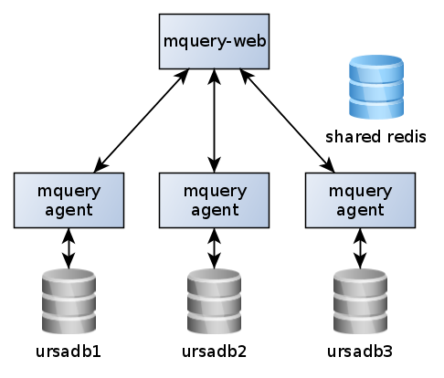
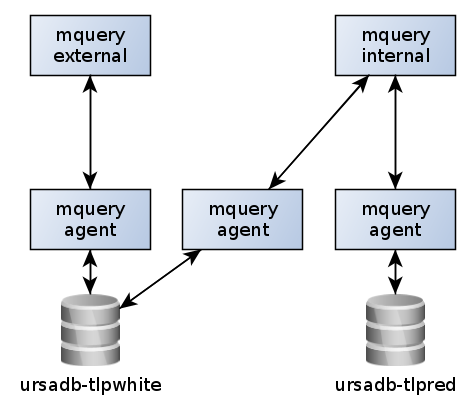

# components

There are four main independent components in mquery deployments:

- web frontend
- daemons (also called "agents" or "workers")
- UrsaDB (backend database)
- Redis

In a normal situation, there is one web frontend, one shared Redis database, and
for every UrsaDB instance, there is a group of one or more agents dedicated to
it:

In most small-to-medium sized deployments there is only one ursadb instance, and
all workers are assigned to it.

More complex configurations are possible, for example, consider this deployment
with internal and external sample index:

### Web frontend (mquery)

Mquery is a standard web application written in Python (using the
Fastapi framework).

It talks with Redis directly, and schedules tasks for the workers.

For some administrative tasks (like checking ongoing tasks) it also sends requests
to UrsaDB directly.

### Mquery daemon (agent)

The workhorse of the entire setup. There must be at least one daemon for
every UrsaDB instance. Daemon's tasks include querying the assigned UrsaDB
instance for samples and running YARA rules on candidate samples.

### Redis

It's a shared database that's used for several purposes. The main one being communication between daemon and mquery.
It is also used as a task queue for jobs scheduled for agents. And it's also
used for persistent storage of job results. Finally, it's utilized to store
plugin configuration and job cache for agents. To sum up, it's pretty overloaded
and used to store everything as the main database of the project.

### UrsaDB

Ursadb is a [separate project](https://github.com/CERT-Polska/ursadb), used in
mquery as a backend database to optimise YARA rules. Ursadb itself has no
understanding of YARA syntax, so all rules are first transpiled by mquery to
a simpler Ursadb syntax before a query.
