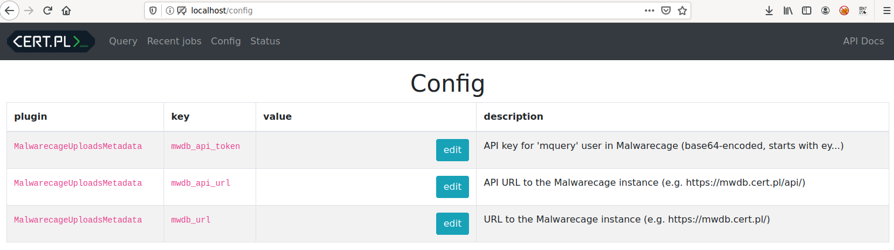

# Configuration

There are three different things you can configure within Mquery: core, plugins
and ursadb. Unfortunately, all are configured differently.

## Mquery core configuration

Mquery is configured with [typed-config](https://github.com/bwindsor/typed-config). There are two ways to pass every configuration field - with
a config file, or a environment variable. For example:

```ini
[redis]
host=redis-server.example.com

[mquery]
backend=tcp://ursadb-server.example.com:9281
plugins=plugins.archive:GzipPlugin
```

This is a simple INI configuration file that mquery understands. It should
be saved in a file called `mquery.ini`. The file should be in one of the
following locations (checked in that order):

* Mquery's working directory (usually `src` folder in the cloned repository)
* In the current user's xdg config directory: `~/.config/mquery/mquery.ini`
* In the system config directory: `/etc/mquery/mquery.ini`

Alternatively, you can use environment variables to configure mquery. All
field names are mapped intuitively to environment variables by joining
the ini section name with a key name - for example, to change redis host
value use `REDIS_HOST`. Environment variables take precedence over values
from the config file!

Currently, supported configuration keys are:

- `redis.host`: Hostname of a main redis server.
- `redis.port`: Port of a main redis server.
- `mquery.backend`: URL to a ursadb instance (for example,
  `tcp://ursadb-server:9281`)
- `mquery.plugins`: List of supported plugins, separated by commas (for
  example `plugins.archive:GzipPlugin, plugins.custom:CustomPlugin`)
- `mquery.yara_limit`: Maximum number of yara-scanned files per query (0 means no limit).
- `mquery.about`: HTML code to be displayed on the about page.
- `rq.job_timeout`: Timeout value for rq jobs. The default is OK for most users.

## Mquery plugin configuration

In contrast to the core configuration, plugins can be configured dynamically.
Every worker registers its list of active plugins in the database, and it's
possible to configure them using the web UI:



This configuration mechanism is used by the plugins shipped with Mquery.
Despite this, it's optional, and plugin authors don't have to use it.
Since plugins are arbitrary code, plugins can read their configuration from
anywhere they want, including the environment, other config files, etc.

It's also easy to use the same config file for Mquery and plugins - see
[example_typed_config_plugin.py](../src/plugins/example_typed_config_plugin.py)
file for an example.

## UrsaDB configuration

UrsaDB is not technically part of Mquery, but both systems work closely
together and depend on each other for optimal performance.

Mquery currently does not allow you to configure UrsaDB nicely.
You have to do it "manually", by connecting with `ursacli` program to the
TCP port exposed by UrsaDB. This program is built together with UrsaDB, and
available in all official docker images. You can execute it in docker compose
like this:

```
docker compose exec ursadb ursacli
```

Or you can download the latest ursadb release and run a client from there.

To set a configuration field, issue a command like this:

```
$ ursacli
ursadb> config set "database_workers" 10;
```

The configuration keys are already documented in the UrsaDB's docs here:
https://cert-polska.github.io/ursadb/configuration.html. We won't copy
all relevant information here, but the most important config keys are:

* `database_workers` - How many tasks can be processed at once (you can
  increase this for strong servers, restart the database to apply).
* `merge_max_files` - Biggest supported dataset size. UrsaDB keeps indexed
  files in so-called "datasets". The fewer datasets the faster the database is,
  but you might not want overly huge datasets (at some point merging datasets
  becomes very slow, and you get diminishing returns for merging them). Decide
  on the value before indexing your files. Good values include the default
  (infinite), 10 million, and 1 million.
* `merge_max_datasets` - a very memory and CPU-intensive operation.
  If your database OOMs during indexing, consider lowering this number and
  the number of `database_workers` that are merging in parallel.

## .env file

Finally, in the main directory of the repository there is a file named `.env`.
Mquery does not use it in any way, but it's read by Docker.

```bash
$ cat .env
# This file is only relevant for docker compose deployments.

# Directory where your samples are stored. By default you have to copy them
# to ./samples subdirectory in this repository.
SAMPLES_DIR=./samples
# Directory where the index files should be saved. By default ./index
# subdirectory in this repository.
INDEX_DIR=./index
```

If you use docker compose to start mquery, you can use this file to specify
a location on the host for your samples_dir and index_dir. These variables are
then used when creating containers. See for example ursadb container spec:

```yaml
  ursadb:
    restart: always
    image: mqueryci/ursadb:v1.5.0
    ports:
    - "127.0.0.1:9281:9281"
    volumes:
    - "${SAMPLES_DIR}:/mnt/samples"
    - "${INDEX_DIR}:/var/lib/ursadb"
    user: "0:0"
```

As you can see, variables from `.env` are used to specify mount point for
the data volumes. You can also ignore this file, and edit docker compose
directly to your liking.
