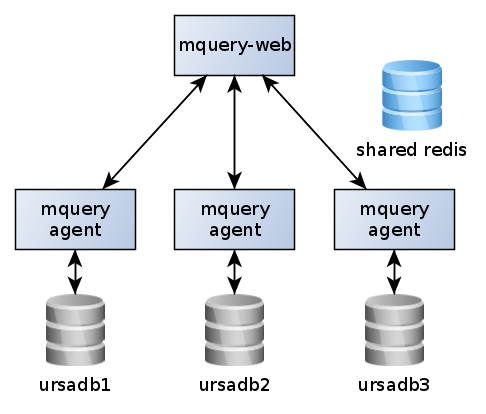

# Distributed mquery

It's possible to use mquery in a distributed way:

Every agent will talk with its dedicated Ursadb instance, queries will
be run on all servers in parallel and results will be merged.

In fact, the default stock configuration is really "distributed", just with
a single agent running on the same machine.

It's also possible to do it "in reverse" - a single Ursadb instance can
be connected to multiple mquery servers:

All of mquery's core functionality works in this setup, but there are some
rough edges. Most notably, HTTP file download is hard to get working
correctly (but hashes are computed and shown correctly).
