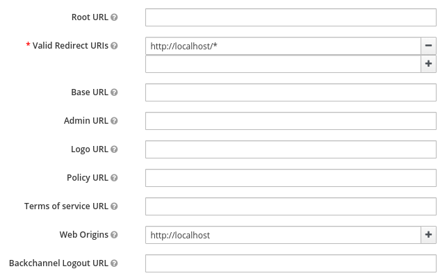

# User management

By default, every mquery user enjoys full admin rights.
This is useful for trying it out, and for locked down or
small deployments. But for larger multi-user deplotments, it may
be useful to restrict what users can do by default.

Optional user management in mquery is role-based, and handled by OIDC.

## Role-based permissions

There are two predefined permission sets that can be assigned to users:

 - `admin`: has access to everything, including management features.
 Can change the service configuration, manage datasets, etc.
 Users with `admin` role can do everything `user`s can.
 - `user`: has access to the analyst features. Can
 create new search jobs, see and cancel every job, and download
 matched files. In current version, users can see and browse
 all jobs in the system.

Role names are considered stable, and will continue to work in the future.

User permissions are then split in more fine-grained permissions:

 - `can_view_queries`: Can view a query with a given ID, and matched files.
 - `can_manage_queries`: Can create, stop, and delete queries.
 - `can_list_queries`: Can list queries (for "recent jobs" tab).
 - `can_download_files`: Can download matched file contents.

It's possible to assign some of these roles directly (instead of giving the
`user` role), but they're currently not considered stable and
may change in some future new version.

(**Note**: in the current version there is no isolation between users, and
users can view/stop/delete each other queries. This may change in the future)

## OIDC integration

Mquery doesn't implement user management. Instead, this is delegated
to an external system, and authentication is handled via OpenID
Connect.

Roles are granted to users by JWT tokens via OIDC, using the
`resource_access` key. For example, token that grants admin role
in the `mquery` client may look like this:

```json
{
  "exp": 1643215666,
  "iat": 1643215366,
  "auth_time": 1643215365,
  "jti": "d82332f7-d22c-45ff-a6dd-cb33fc1526a3",
  "sid": "4c9f8999-dcb3-48b3-a7ef-aad4cf44f518",
  "iss": "http://localhost:8080/auth/realms/myrealm",
  "aud": "account",
  "sub": "f7ddae72-63e8-4233-a83b-699643761a6e",
  "typ": "Bearer",
  "azp": "mquery",
  "session_state": "4c9f8999-dcb3-48b3-a7ef-aad4cf44f518",
  "acr": "1",
  "realm_access": {
    "roles": [
      "default-roles-myrealm",
      "offline_access",
      "uma_authorization"
    ]
  },
  "resource_access": {
    "mquery": {
      "roles": [
        "admin",
        "user"
      ]
    }
  },
  "scope": "email profile",
  "email_verified": false,
  "preferred_username": "msm"
}
```

Token generation is handled by the OIDC software automatically.
Administrators just have to assign appropriate permissions and
groups to the allowed users.

## Step-by-step Configuration

In this section we will go over configuration using Keycloak - open
source identity management solution. In principle, it should work
with any other OIDC-capable system.

We assume that mquery is hosted at `http://localhost`,
and Keycloak is hosted at `http://localhost:8080`. Change the URLs
as necessary for your deployment. 

**Warning** the proces is tricky, and right now it's missing a proper validation.
It's possible to lock yourself out (by enabling auth before configuring it
correctly). If you do this, you have to disable auth manually, by running
`redis-cli` (`sudo docker-compose exec redis redis-cli` for docker) and
executing `HMSET plugin:Mquery auth_enabled ""`.

**Step 0 (optional): enable auth in non-enforcing mode**

- Go to the `config` page in mquery (http://localhost/config). Set `auth_default_roles` to `admin`
- Set `auth_enabled` to `true`

**Step 1: configure keycloak**

- Go to the Keycloak's admin console (http://localhost:8080/auth/admin/master/console/) and login
(default credentials are admin:admin).
- Click "Add realm" on the left and create a new realm in Keycloak. Let's call it `myrealm`:


- Add a client to the realm, let's call it `mquery`:


- Edit the client, and set `Valid Redirect URIs` to `http://localhost/*` (or `http://[mquery_url]/*`) and `Web Origins` to `http://localhost` (or `http://[mquery_url]`).



- Go to the `roles` subpage **in the client**, and add `admin` and `user` roles.


- Create a new user in your realm. Let's call them `john`:


- Edit the user. In `Credentials` add a new password for the user.

- In `Role mappings`, select `mquery` client in the `client roles`
and grant appropriate roles to the user (remember to grant yourself an admin role! You can have both `admin` and `user` roles).

**Step 2: configure mquery**

Go back to the config page again (http://localhost/config).

- Set `openid_url` to `http://localhost:8080/auth/realms/myrealm/protocol/openid-connect`
- Set `openid_client_id` to `mquery` (`client id` from the step 1)
- Set `openid_secret` to the `RS256` public key of your realm.
Get it from `http://localhost:8080/auth/admin/master/console/#/realms/myrealm/keys`
(configure -> realm settings -> public key)

**Step 3: enable auth in enforcing mode**

- Go to the `config` page in mquery. Ensure `auth_default_roles` is
an empty string.
- Set `auth_enabled` to `true`

Final result:


**Step 4: reload and done**

Reload the page. You should be redirected to your login page. Enter the password you've
configured, and if everything was set-up correctly, you should be back as a logged in user.
