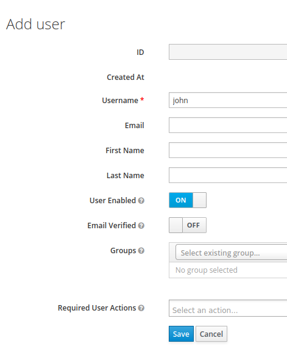

# User management

**Warning: this is a WIP feature. Users are advised to wait for a 1.3 release before trying it out in production**

By default, every mquery user enjoys full admin rights.
This is useful for trying it out, and for locked down or
small deployments. But for larger multi-user deplotments, it may
be useful to restrict what users can do by default.

Optional user management in mquery is role-based, and handled by OIDC.

## Role-based permissions

As of now (v1.3 pre-releases) there are two defined roles:

 - `user`: has access to the analyst features. Can
 create new search jobs, see and cancel every job, and download
 matched files.
 - `admin`: has access to the management features. Can change the
 service configuration, manage datasets, etc. Users with `admin`
 role can do everything `user`s can.

**Note**: Before the release, `user` role will be improved.
Right now, normal user can see jobs belonging to other users.

## OIDC integration

Mquery doesn't implement user management. Instead, this is delegated
to an external system, and authentication is handled via OpenID
Connect.

Roles are granted to users by JWT tokens via OIDC, using the
`resource_access` key. For example, token that grants admin role
in the `mquery` client may look like this:

```json
{
  "exp": 1643215666,
  "iat": 1643215366,
  "auth_time": 1643215365,
  "jti": "d82332f7-d22c-45ff-a6dd-cb33fc1526a3",
  "sid": "4c9f8999-dcb3-48b3-a7ef-aad4cf44f518",
  "iss": "http://localhost:8080/auth/realms/myrealm",
  "aud": "account",
  "sub": "f7ddae72-63e8-4233-a83b-699643761a6e",
  "typ": "Bearer",
  "azp": "mquery",
  "session_state": "4c9f8999-dcb3-48b3-a7ef-aad4cf44f518",
  "acr": "1",
  "realm_access": {
    "roles": [
      "default-roles-myrealm",
      "offline_access",
      "uma_authorization"
    ]
  },
  "resource_access": {
    "mquery": {
      "roles": [
        "admin",
        "user"
      ]
    }
  },
  "scope": "email profile",
  "email_verified": false,
  "preferred_username": "msm"
}
```

Token generation is handled by the OIDC software automatically.
Administrators just have to assign appropriate permissions and
groups to the allowed users.

## Step-by-step Configuration

In this section we will go over configuration using Keycloak - open
source identity management solution. In principle, it should work
with any other OIDC-capable system.

We assume that mquery is hosted at `http://localhost`,
and Keycloak is hosted at `http://localhost:8080`. Change the URLs
as necessary for your deployment. 

TODO: port https://github.com/CERT-Polska/mquery/pull/252

**Warning** the proces is tricky, and right now it's missing a proper validation.
It's possible to lock yourself out (by enabling auth before configuring it
correctly). If you do this, you have to disable auth manually, by running
`redis-cli` (`sudo docker-compose exec redis redis-cli` for docker) and
executing `HMSET plugin:Mquery auth_enabled ""`.

**Step 0 (optional): enable auth in non-enforcing mode**

- Go to the `config` page in mquery. Set `auth_default_roles` to `admin`
- Set `auth_enabled` to `yes`

**Step 1: configure keycloak**

- Go to the Keycloak's admin console (http://localhost:8080/auth/admin/master/console/) and login.
- Create a new realm in Keycloak. Let's call it `myrealm`:


- Add a client to the realm, let's call it `mquery`:


- Edit the client, and set `Valid Redirect URIs` to `http://localhost/auth` (or `http://[mquery_url]/auth`).

- Go to the `roles` subpage, and add "admin" and "user" roles.


- Add your user to the realm. Let's call it `john`:



- Edit the user. In `Credentials` add a new password for the user.

- In `Role mappings`, select `mquery` client in the `client roles`
and grant appropriate roles to the user.

**Step 2: configure mquery**

- Set `opeind_auth_url` to `http://localhost:8080/auth/realms/myrealm/protocol/openid-connect/token`
- Set `opeind_client_id` to `mquery` (`client id` from the step 1)
- Set `opeind_login_url` to `http://localhost:8080/auth/realms/myrealm/protocol/openid-connect/auth?client_id=mquery&response_type=code` (chgnage client_id if needed)
- Set `openid_secret` to the `RS256` public key of your realm.
Get it from `http://localhost:8080/auth/admin/master/console/#/realms/myrealm/keys`
(configure -> realm settings -> public key)

**Step 3: enable auth in enforcing mode**

- Go to the `config` page in mquery. Ensure `auth_default_roles` is
an empty string.
- Set `auth_enabled` to `yes`

Final result:

